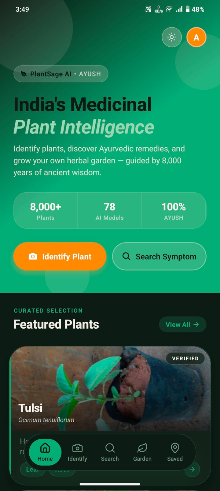
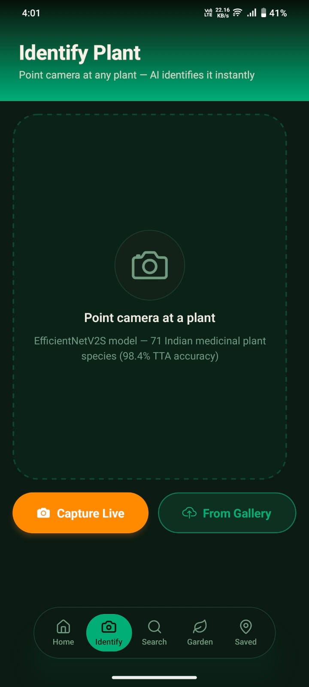
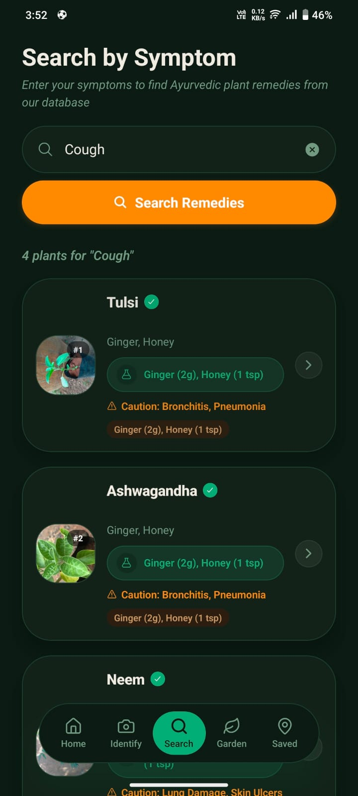
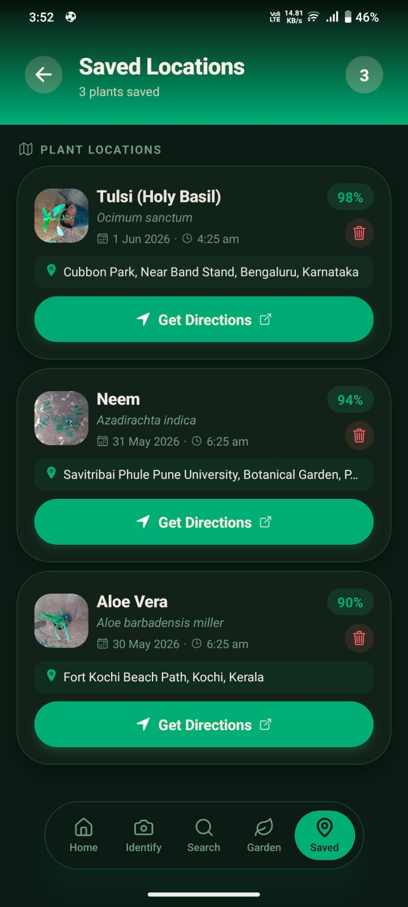
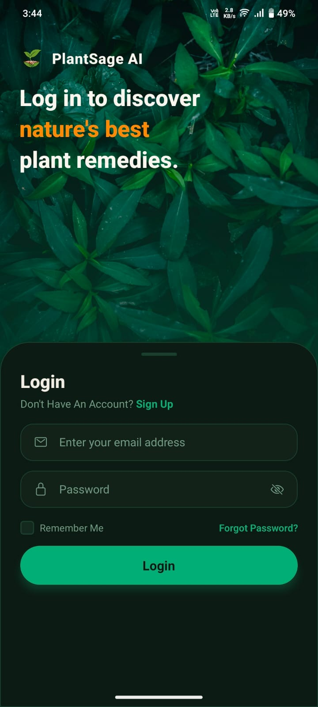
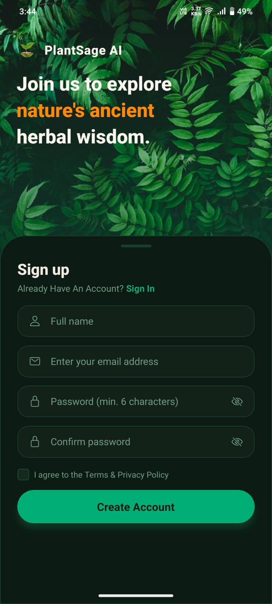

# 🌿 PlantSage AI — AI-Powered Medicinal Plant Identifier & Ayurvedic Wellness Assistant

PlantSage AI is a mobile application designed to bridge traditional Ayurvedic botanical knowledge with modern deep learning. The app provides real-time, high-accuracy identification of Indian medicinal plant species while offering a comprehensive safety validation layer to prevent the accidental ingestion of toxic look-alikes.

---

## ⚠️ The Problem: Plant Poisoning in Rural Areas

In rural and semi-urban communities, traditional herbal remedies are frequently used for primary healthcare. However, the lack of professional botanical guidance leads to significant safety hazards:

* **Dangerous Look-Alikes:** Many medicinal herbs share near-identical leaf structures with toxic weeds.
* **Health Impact:** According to clinical studies published in the **Indian Journal of Pediatrics / Indian Journal of Critical Care Medicine**, plant poisoning accounts for approximately **1.7% to 8.0% of total poisoning admissions** in rural areas, often caused by accidental ingestion of toxic species like *Lantana camara*, *Nerium oleander* (Arali), and *Calotropis gigantea* (Ekka).
* **Information Gap:** Users lack an immediate, verified resource to cross-check plant safety, learn the correct dosages, review formulations, or access research-backed information.

PlantSage AI addresses this gap by combining an edge-deployed computer vision model with cloud-based generative AI to verify species, deliver toxicity warnings, and map out safe Ayurvedic remedies.

---

## 🚀 Key Features

* **Dual-Layer Validation Engine:** Runs a local, low-latency classifier on the device which falls back to cloud-based **Gemini Vision** for high-precision validation of ambiguous or low-confidence captures.
* **Instant Toxicity Alerts:** Proactively flags known toxic species (e.g., *Lantana*, *Arali*, *Ekka*, *Makoy*) with custom alerts and detailed toxicity summaries.
* **Symptom-to-Remedy Lookup:** Features an intelligent search mapping symptoms and ailments to safe, AYUSH-recognized medicinal plants using a local **446-entry AyurGenix database**.
* **Remedy & Research Integration:** Provides step-by-step preparation guidelines, custom formulations, linked **YouTube remedy videos**, and relevant **scientific research papers** for each identified plant.
* **GPS Species Garden Logger:** Automatically logs plant discoveries with exact coordinates and **reverse-geocoded friendly addresses**, checking for duplicates using the **Haversine formula** within a 100-meter radius to help users map out their local herbs.
* **Secure User Portal:** Features full user profile management with JWT session renewals and Google OAuth login backed by a FastAPI/MongoDB backend.

---

## 📱 Interactive Workflows (GIFs)

### 1. Plant Identification & Discovery
Below is the workflow showing the seamless capture, classification, and retrieval of Ayurvedic formulations for a safe medicinal plant:

<p align="center">
  
</p>

*After identification, users can read through uses, botanical details, research papers, and localized remedies:*

<p align="center">
  
</p>

### 2. Toxic Plant Detection & Alerts
When the app detects a toxic look-alike, it instantly interrupts the flow with a highly visible safety warning warning the user against consumption or contact:

<p align="center">
  
</p>

---

## 🎨 Application Screenshots

### Core Interfaces & Workflows

<div align="center">

| Home Dashboard | Camera Classification | Ayurvedic Ailment Search |
| :---: | :---: | :---: |
|  |  |  |

| Herb Location Mapping | User Authentication | Profile Creation |
| :---: | :---: | :---: |
|  |  |  |

</div>

---

## 📐 Technical Architecture

PlantSage AI operates a hybrid mobile-cloud architecture designed to optimize latency, preserve safety, and provide rich AI features:

```
  ┌─────────────────────────────────────────────────────────────────────────────────────────┐
  │                                   React Native Mobile Client                            │
  │                                  (Expo / TypeScript Frontend)                           │
  └───────┬───────────────────────────────────────┬──────────────────────────────────┬──────┘
          │                                       │                                  │
          │ [Image Capture]                       │ [Ailment/Symptom Search]         │ [Location Log / GPS]
          ▼                                       ▼                                  ▼
  ┌────────────────────────┐             ┌────────────────────────┐        ┌────────────────────────┐
  │  On-Device Classifier  │             │   FastAPI Web Server   │        │   FastAPI Web Server   │
  │  · EfficientNetV2S     │             │    (Python API Host)   │        │    (Python API Host)   │
  │  · TFLite INT8 format  │             └───────────┬────────────┘        └───────────┬────────────┘
  └───────┬────────────────┘                         │                                 │
          │                                          │                                 │
          ├─────► [High Confidence] ────►            ▼                                 ▼
          │       (Retrieve AyurGenix Info) ┌────────────────────────┐        ┌────────────────────────┐
          │                                 │   AyurGenix Database   │        │    MongoDB Database    │
          ▼ [Low Confidence / Ambiguous]    │   · 446 Ailment Maps   │        │    · User Profiles     │
  ┌────────────────────────┐                │   · Doshas & Diets     │        │    · Saved Gardens     │
  │   Gemini Vision API    │                │   · YouTube remedies   │        │    · Lat / Long        │
  │   (Cloud Verification) │                │   · Scientific papers  │        │    · Reverse Geocodes  │
  └────────────────────────┘                └────────────────────────┘        └────────────────────────┘
```

### Flow Walkthrough:
1. **Edge Inference:** The mobile client captures an image and runs a local **EfficientNetV2S model** (converted to an optimized **INT8 TFLite** format). If the classification confidence is high, it pulls local botanical information instantly.
2. **Cloud Fallback (Gemini Vision):** If the classification is ambiguous or falls below the confidence threshold, the image is securely proxied to the **FastAPI backend**, which queries **Gemini Vision** for double-validation.
3. **Ayurvedic Lookup:** Once identified, the backend matches the species against the **446-entry AyurGenix dataset**, outputting formulations, diets, lifestyle recommendations, YouTube videos, and research papers.
4. **GPS Logging:** Saved plant species are stored in a **MongoDB** database, which queries reverse-geocoding APIs for location addresses and employs the **Haversine formula** to prevent duplicate logs within 100 meters.

---

## 🛠️ Machine Learning Model Details

* **Architecture:** EfficientNetV2S (Trained using a 3-phase unfreezing strategy with frozen BatchNorm layers to prevent catastrophic forgetting).
* **Classes:** 71 Indian medicinal plant classes.
* **Accuracy:**
  * **96.6%** validation accuracy (single pass).
  * **98.4%** validation accuracy with 4-pass **Test-Time Augmentation (TTA)**.
* **Quantization:** Converted to an INT8-quantized TFLite file (~20MB) optimized for on-device mobile hardware.

---

## 📦 Releases

You can download the pre-compiled application package directly without building from source:

1. Navigate to the [Releases](https://github.com/yourusername/plantsage-ai/releases) tab of this repository.
2. Download the latest **`PlantSage_AI.apk`** file.
3. Transfer the APK to your Android device and install it (ensure that installation from unknown sources is enabled in your device settings).
